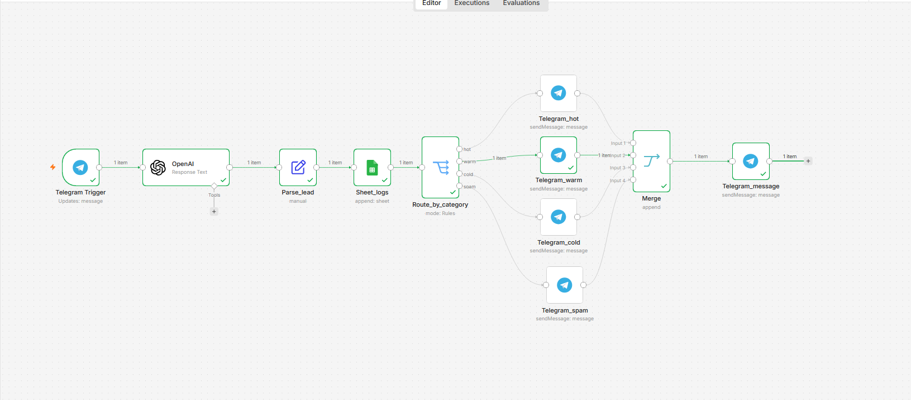

# AI Lead Qualifier

Telegram-бот для автоматической квалификации входящих лидов с помощью GPT-4o-mini.

## Что делает

Принимает заявку в Telegram.
AI анализирует текст → классифицирует лид
отправляет менеджеру уведомление с приоритетом.
Google Sheets логирование

## Категории лидов

| Категория | Приоритет | Описание |
|-----------|-----------|----------|
| 🔥 Горячий | 1 | Явный интерес + бюджет + срочность |
| 🌡 Тёплый | 2 | Интерес есть, нет срочности или бюджета |
| ❄️ Холодный | 3 | Общий интерес, нет конкретики |
| 🚫 Нецелевой | 4 | Спам, реклама, не по теме |

## Архитектура
Telegram Trigger
↓
OpenAI GPT-4o-mini (classification JSON mode)
↓
Parse_lead (Edit Fields — маппинг данных)
↓
Route_by_category (Switch node)
↓ hot      ↓ warm     ↓ cold     ↓ spam
Telegram   Telegram   Telegram   Telegram

## Стек

- n8n (Docker, localhost)
- OpenAI GPT-4o-mini
- Telegram Bot API

## Как запустить

1. Импортируй `ai_lead_qualifier_v1.json` в n8n
2. Добавь credentials:
   - OpenAI API key
   - Telegram Bot token
3. Активируй workflow

## Демо

## Бизнес-ценность

Менеджер получает только приоритизированные уведомления.
Горячие лиды обрабатываются немедленно — холодные не теряются.

Подходит для: отделов продаж, агентств, фрилансеров с входящими заявками.
